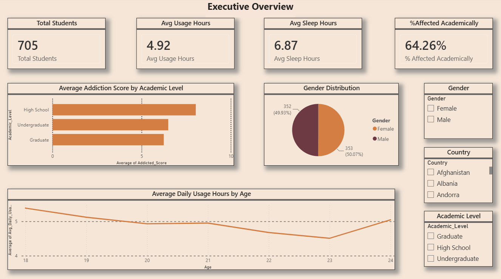
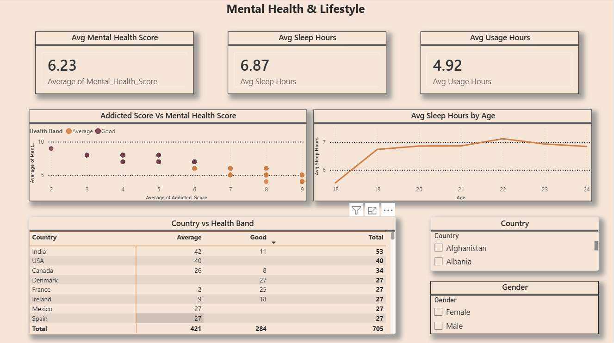
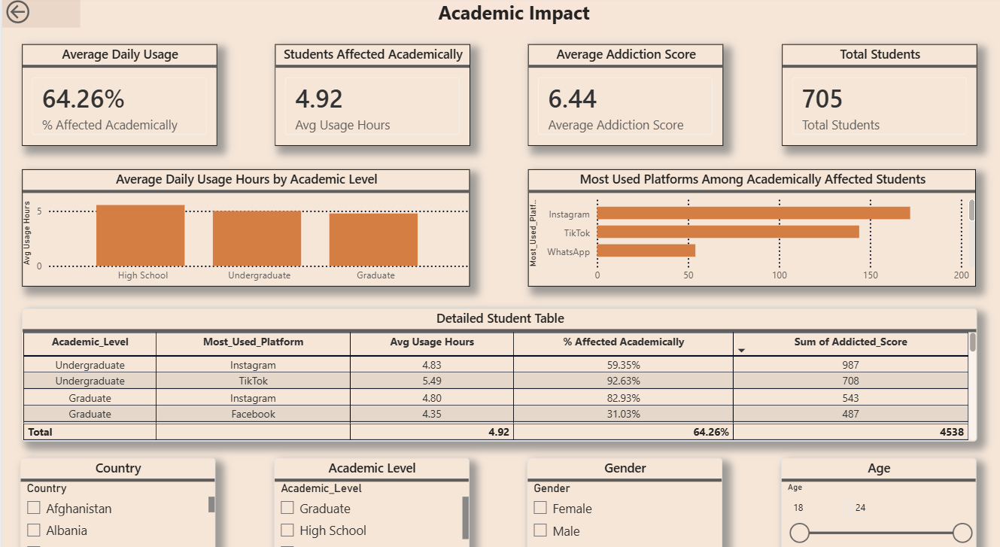
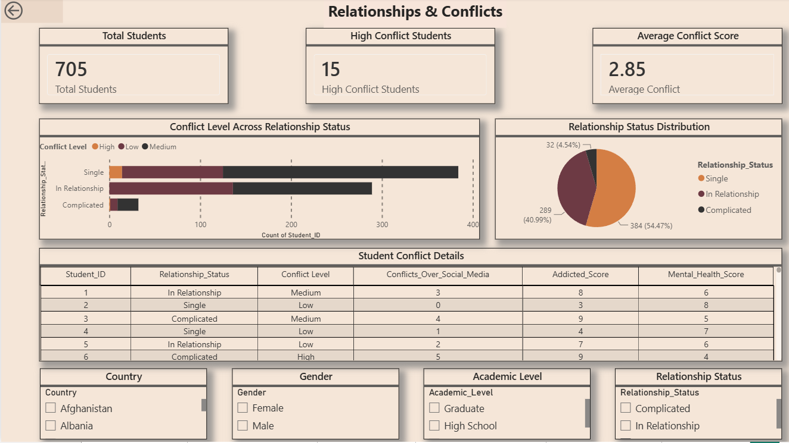

# 📊 Social Media Usage Analytics Dashboard

## 📷 Dashboard Preview

### Executive Overview

---

### Mental Health & Lifestyle

---

### Academic Impact

---

### Relationships & Conflicts

---

### Interactive Story – Gender View

---

### Interactive Story – Academic View

---

### Student Profile (Drill-through)

---

## 📌 Project Overview
This Power BI dashboard analyzes how students' social media usage impacts:
- Mental Health
- Sleep Hours
- Academic Performance
- Relationship Status

## 🛠️ Tools Used
- Power BI
- DAX
- Data Modeling
- Data Visualization

## 📄 Dashboard Pages
- Executive Overview
- Mental Health & Lifestyle
- Academic Impact
- Relationships & Conflicts
- Interactive Story View
- Student Profile (Drill-through)

## ⭐ Features
- KPI Cards
- Interactive Slicers
- Bookmarks
- Drill-through
- Star Schema
- Calculated Columns
- DAX Measures
